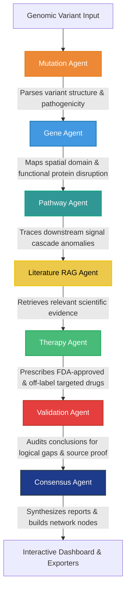

# 🧬 BioReason-X

### **Mutation &rarr; Mechanism &rarr; Therapy Clinical Decision Intelligence Platform**

[](https://github.com)
[](https://streamlit.io)
[](https://github.com/langchain-ai/langgraph)
[](https://github.com)

BioReason-X is an enterprise-grade precision oncology decision support platform designed for molecular pathologists, genetic researchers, clinical tumor boards, and oncologists. The system automates clinical reasoning by tracing raw genomic variants (e.g. HGVS or amino acid mutations) to their downstream cellular disruptions, associated malignancies, and targeted therapeutic solutions. It accomplishes this using a multi-agent workflow framework, localized Retrieval-Augmented Generation (RAG), and a dual-engine biomedical knowledge graph.

---

## 🌟 Core Platform Features

*   **🎨 Premium Clinical UI/UX**: Built with an elegant, responsive interface utilizing custom modern typography (Outfit and Inter Google Fonts), sleek glassmorphism panels (`glass-card`), and interactive hover micro-animations.
*   **🤖 Multi-Agent LangGraph Orchestration**: Leverages 7 specialized, context-sharing clinical agents that work sequentially to interpret, trace, map, retrieve, recommend, audit, and synthesize genomic mutation briefs.
*   **🕸️ Interactive Biomedical Knowledge Graph**: Features a dynamic Vis.js/Pyvis visualization panel. Nodes represent biological entities colored by type (Mutation, Gene, Protein, Pathway, Disease, Drug, Publication) and edges show targeted mechanistic relations. Contains built-in **automatic client-side dark/light mode detection** for seamless style integration.
*   **📖 Explainable AI (XAI) Guide**: Includes an interactive tutorial and guided tour translating complex biological pathways and graph nodes/edges (such as *affects*, *encodes*, *participates_in*, *associated_with*, *targets*, *supports*) into clear, natural language descriptions for non-experts.
*   **🔍 Precision RAG Evidence Explorer**: Ingests scientific abstracts and indexes clinical trials. Renders search results with a custom **Match Affinity indicator** (0-100% progress bar) denoting semantic vector similarity.
*   **📋 Dossier Export Hub & Live Preview**: Allows practitioners to preview reports instantly in a structured white medical sheet layout. Generates downloadable clinical PDFs (custom headers, tabular matrices, bibliography) and fully editable Microsoft Word (DOCX) files.
*   **⚡ Local-First & Cloud Hybrid**: Built to operate on local LLMs (via Ollama/vLLM) with latency-optimized configurations, or scale to cloud LLMs (Gemini API) and graph databases (Neo4j).

---

## 🧬 System Architecture & File Layout

The codebase follows a modular design, separating the agentic orchestration, data structures, and user interface:

```
BioReason-X/
├── app.py                     # Streamlit entrance & page router
├── requirements.txt           # Python package dependencies
├── README.md                  # System operation manual (this file)
├── data/
│   ├── literature_db.json     # Pre-seeded RAG abstracts corpus
│   ├── faiss_index/           # Cached vector database indexes
│   └── networkx_graph.gpickle # Serialized local graph cache
├── backend/
│   ├── agents/
│   │   ├── state.py           # LangGraph session state representation
│   │   ├── mutation_agent.py  # Agent 1: HGVS variant interpreter
│   │   ├── gene_agent.py      # Agent 2: Molecular protein disruption mapping
│   │   ├── pathway_agent.py   # Agent 3: Pathway cascade disruption tracer
│   │   ├── literature_agent.py# Agent 4: Semantic RAG retrieval
│   │   ├── therapy_agent.py   # Agent 5: Precision drug prescription
│   │   ├── validation_agent.py# Agent 6: Logical fact-check auditor
│   │   ├── consensus_agent.py # Agent 7: Consensus report synthesizer
│   │   └── workflow.py        # LangGraph StateGraph assembler & graph updater
│   ├── knowledge_graph/
│   │   └── graph_builder.py   # Neo4j and NetworkX graph controller
│   ├── rag/
│   │   ├── embedder.py        # SentenceTransformers / TF-IDF manager
│   │   └── retriever.py       # FAISS database / NumPy Cosine similarity engine
│   └── utils/
│       ├── config.py          # Environment settings, logger, path config
│       ├── gemini_client.py   # Gemini API connector with backup mock templates
│       ├── pdf_generator.py   # ReportLab PDF clinical generator
│       └── doc_generator.py   # Word (docx) report exporter
└── frontend/
    └── pages/
        ├── Home.py            # Landing interface, case templates, pipeline trigger
        ├── Analysis.py        # Multi-agent clinical reasoning card layout
        ├── EvidenceExplorer.py# Scientific literature RAG & Match Affinity view
        ├── ExplainableAI.py   # Reasoning graph interactive guide and legends
        ├── KnowledgeGraph.py  # Interactive NetworkX / Pyvis vis.js graph
        └── ReportGenerator.py # PDF/DOCX exporters and paper-styled report preview
```

### 🔁 Multi-Agent Clinical Workflow Pipeline

The analytical pipeline coordinates the sequential work of 7 agents in a LangGraph state container:



---

## 🛠️ Setup Instructions

### 0. Prerequisites
- Python **3.9, 3.10, or 3.11** installed.
- (Optional) Docker or local service instances for Ollama/Neo4j.

### 1. Local Model Server Configuration (Ollama / vLLM)

To process reasoning offline without commercial API charges, configure a local model server.

#### Option A: Running via Ollama (Easiest)
Install Ollama, start the service, and download your target reasoning model:
```bash
# Start Ollama background process
nohup ollama serve > ollama.log 2>&1 &

# Verify it is running
cat ollama.log 

# Fetch and run deepseek-r1 (or other compatible models like llama3)
ollama run deepseek-r1:32b
```

#### Option B: Running via vLLM (Optimized for Latency)
For high-throughput multi-agent environments, running vLLM with AWQ quantization and Prefix Caching is recommended to significantly reduce agent turnaround latency:
```bash
# Startup vLLM server with prefix caching (saves context tokens between agent calls)
nohup python -m vllm.entrypoints.openai.api_server \
  --model casperhansen/deepseek-r1-distill-qwen-32b-awq \
  --quantization awq \
  --port 8000 \
  --host 127.0.0.1 \
  --max-model-len 4096 \
  --enable-prefix-caching \
  --trust-remote-code ----dtype float16> vllm.log 2>&1 &

nohup python -m vllm.entrypoints.openai.api_server \
  --model casperhansen/deepseek-r1-distill-qwen-32b-awq \
  --quantization awq \
  --port 8000 \
  --host 127.0.0.1 \
  --max-model-len 8192 \
  --trust-remote-code -- > vllm.log 2>&1 &
```
*Tip: `--enable-prefix-caching` is vital here. Since each agent shares the state and historical reasoning context, caching common system templates and history boosts throughput by up to 3x.*

---

### 2. Environment Installation

Clone or navigate to the workspace directory and configure your Python environment:
```bash
# Create virtual environment
python -m venv .venv

# Activate virtual environment
# On Windows (PowerShell):
.venv\Scripts\Activate.ps1
# On macOS/Linux:
source .venv/bin/activate 

# Upgrade pip and install package requirements
pip install --upgrade pip
pip install -r requirements.txt
```

> [!NOTE]
> If compilation issues arise while installing heavy packages (like `faiss-cpu` or `sentence-transformers`) on your local hardware/OS, the codebase **automatically activates fallbacks**: TF-IDF bag-of-words vectorization and NumPy-based cosine similarity matrix lookups. The application remains 100% operational.

---

### 3. API Keys & Database Configuration

Create a file named `.env` in the project root directory to configure live external integrations:

```env
# Gemini API Key (Enables live cloud AI reasoning instead of local simulation)
GEMINI_API_KEY=AIzaSy...

# Neo4j Credentials (Enables writing graph structures to a live Neo4j cluster)
NEO4J_URI=bolt://localhost:7687
NEO4J_USER=neo4j
NEO4J_PASSWORD=mySecurePassword
```

> [!TIP]
> **Clinical Simulation Mode (Demo Mode)**
> If no API keys are specified in `.env`, the system automatically runs in **Clinical Simulation Mode**. The workflow bypasses live API connections and generates detailed mock templates matching our demo profiles (BRCA1, EGFR, BRAF) or synthesizes reasonable mock predictions. This allows developers to test the entire visual dashboard, graph physics, and report exporters instantly without external setup.

---

## 🚀 Running the App

Start the Streamlit application:
```bash
streamlit run app.py
```

Streamlit will boot up the application and automatically open your default browser. If running on a headless server, use the following flags to disable unnecessary security blockages:
```bash
streamlit run app.py --server.port 8501 --server.headless true --server.enableCORS false --server.enableXsrfProtection false --server.fileWatcherType poll
```
Access the client-facing UI at `http://localhost:8501`.

---

## 📝 Pre-loaded Clinical Case Studies (Quick Start)

On the **Home Overview** page, click any of the preloaded clinical templates to inspect the dashboard immediately:

1.  **`BRCA1 c.5266dupC`**:
    *   *Pathology*: Frameshift insertion introducing a premature stop codon.
    *   *Mechanism*: Loss of Homologous Recombination Deficiency (HRD).
    *   *Targeted Therapy*: PARP Inhibitor (Olaparib) via synthetic lethality mechanism.
2.  **`EGFR L858R`**:
    *   *Pathology*: Exon 21 missense mutation (Leucine to Arginine).
    *   *Mechanism*: Hyperactivation of the intracellular tyrosine kinase domain.
    *   *Targeted Therapy*: 3rd Generation EGFR TKI (Osimertinib).
3.  **`BRAF V600E`**:
    *   *Pathology*: Exon 15 missense mutation (Valine to Glutamic Acid).
    *   *Mechanism*: Promotes active monomer signaling, bypassing upstream RAS triggers.
    *   *Targeted Therapy*: BRAF/MEK combined inhibitors (Vemurafenib / Trametinib).

---

## ⚙️ Production Deployment & Operations Guidance

1.  **Host Scaling**: Standard Docker containers or VM instances (AWS EC2, Google Compute Engine) can easily run the application front-end. Streamlit configurations default to responsive wide-layout structures.
2.  **External Neo4j Graph Database**: Replace local memory-based NetworkX files with a managed Neo4j instance (e.g. AuraDB cloud instance) by setting the `NEO4J_*` credentials inside the environment variables.
3.  **API Rate Limiting**: The live connector utilizes `gemini-2.5-flash` or newer models. For production deployment, implement token-bucket session limits or API key rotation configurations.
4.  **Clinical Data Privacy**: In compliance with HIPAA and GDPR medical records protection standards, this platform does not transmit Protected Health Information (PHI) to public servers; all reasoning runs locally or goes through enterprise-cleared secure API endpoints.
